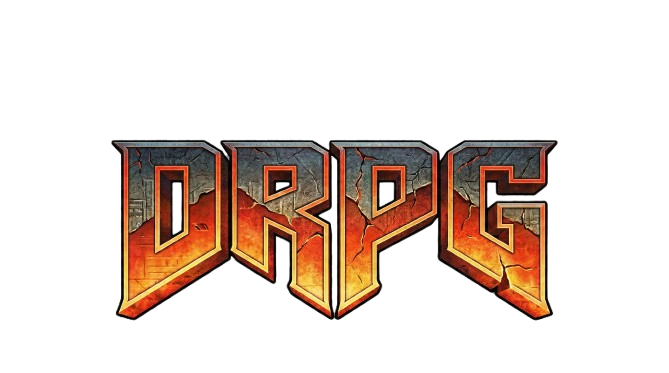

# DRPG Engine



## Building

### Dependencies

- CMake 3.22+
- SDL2
- Zlib
- OpenAL
- OpenGL

### Game Assets

You need the original `Doom 2 RPG.ipa` file placed in the project root. This file is not included in the repository.

### Linux

```bash
sudo apt-get install cmake build-essential libsdl2-dev zlib1g-dev libopenal-dev libgl-dev
cmake -B build -DCMAKE_BUILD_TYPE=Release
cmake --build build --parallel
```

### macOS

```bash
brew install sdl2 openal-soft
cmake -B build -DCMAKE_BUILD_TYPE=Release
cmake --build build --parallel
```

Or use the convenience script:

```bash
./build-macos.sh
```

### Windows

```bash
vcpkg install sdl2:x64-windows zlib:x64-windows openal-soft:x64-windows
cmake -B build -DCMAKE_BUILD_TYPE=Release -DCMAKE_TOOLCHAIN_FILE="%VCPKG_INSTALLATION_ROOT%/scripts/buildsystems/vcpkg.cmake"
cmake --build build --config Release --parallel
```

## Project Structure

```
src/
├── converter/   # CLI tool: extracts assets from .ipa → YAML + binaries in games/
├── editor/      # Map editor with BSP compiler, camera, and Dear ImGui UI
├── engine/      # Platform layer: SDL/GL, TinyGL renderer, input, sound, VFS, menus, scripting
└── game/        # Game logic: entities, combat, player, minigames, game states

games/doom2rpg/  # Converted game assets (YAML configs + binary data, not checked in)
tools/           # Python extraction scripts (extract_*.py) and HTML viewers
docs/            # Binary format specs and modding guides
Testing/         # Test scripts for automated map/minigame validation
scripts/         # Shell scripts for smoke testing
```

## Asset Pipeline

```
*.ipa  →  drpg-convert (or tools/*.py)  →  games/doom2rpg/
                                                          ├── *.yaml (entities, weapons, monsters, strings, ...)
                                                          ├── levels/maps/*.bin
                                                          ├── audio/, fonts/, hud/, ui/, ...
                                                          └── ...
```

The YAML files in `games/doom2rpg/` define game content (entities, weapons, monsters, strings, etc.) and can be edited for modding. Binary `.bin` map files should be edited through the map editor, not by hand.

## Architecture

The project is a game engine for classic mobile RPG formats, written in C++17:

- **Rendering**: SDLGL → GLES → Render → Canvas (BSP-based pipeline with TinyGL software rasterizer)
- **Game Logic**: Game, Entity, Combat, Player (entity-based game systems)
- **Scripting**: ScriptThread (bytecode execution for game scripts)
- **UI/Menu**: MenuSystem, Hud, Button (menu and HUD rendering)
- **Audio**: Sound (OpenAL-based, 10 concurrent channels)
- **Input**: Input (keyboard, mouse, and gamepad)
- **Data**: Resource, VFS, ZipFile, JavaStream (asset loading)
- **Minigames**: HackingGame, SentryBotGame, VendingMachine, ComicBook

See [docs/](docs/) for binary format specs and [docs/modding/](docs/modding/) for modding guides.

## Running

```bash
./build/src/DRPGEngine --game doom2rpg
```

### Game CLI Options

| Flag                   | Description                                                    |
| ---------------------- | -------------------------------------------------------------- |
| `--game <name>`        | Game module under `games/` (e.g. `doom2rpg`)                   |
| `--gamedir <path>`     | Explicit game directory path                                   |
| `--map <path>`         | Load a specific map (e.g. `levels/maps/map09.bin`)             |
| `--minigame <name>`    | Launch a minigame directly (`hacking`, `sentrybot`, `vending`) |
| `--skip-intro`         | Skip the intro sequence                                        |
| `--skip-travel-map`    | Skip the travel map (auto-set when `--map` is used)            |
| `--headless`           | Run without a window (for testing)                             |
| `--ticks <n>`          | Exit after N ticks (for testing)                               |
| `--seed <n>`           | Set random seed (for reproducible runs)                        |
| `--script <path>`      | Run a test script (e.g. `Testing/test_map09.script`)           |

### Converter CLI Options

```bash
./build/src/converter/drpg-convert --ipa "Doom 2 RPG.ipa" --output games/doom2rpg
```

| Flag               | Description                                      |
| ------------------ | ------------------------------------------------ |
| `--ipa <path>`     | Path to `Doom 2 RPG.ipa` file                    |
| `--output <dir>`   | Output directory (default: `games/doom2rpg`)      |
| `--force`, `-f`    | Overwrite existing output                         |
| `--help`, `-h`     | Show usage                                        |

## Default Key Configuration

| Action          | Key     |
| --------------- | ------- |
| Move Forward    | W, Up   |
| Move Backward   | S, Down |
| Move Left       | A       |
| Move Right      | D       |
| Turn Left       | Left    |
| Turn Right      | Right   |
| Atk/Talk/Use    | Return  |
| Next Weapon     | Z       |
| Prev Weapon     | X       |
| Pass Turn       | C       |
| Automap         | Tab     |
| Menu Open/Back  | Escape  |
| Menu Items/Info | I       |
| Menu Drinks     | O       |
| Menu PDA        | P       |
| Bot Dis/Ret     | B       |

## Cheat Codes

J2ME/BREW version - open menu and enter these numbers:<br>
3666 -> Debug menu / Menu debug<br>
1666 -> Restart level / Reinicia el nivel<br>
4332 -> All keys, items, weapons / Todas las llaves, items y armas<br>
3366 -> Speed benchmark / Testeo de velocidad

## Status

This is an early-stage reverse engineering project (v0.1.0). Many reverse-engineered field names still use placeholder names (e.g., `field_0x7c`). Contributions to improve naming, fix bugs, and document behavior are welcome.

## Editor

The map editor lets you view and edit maps — change tile geometry, heights, textures and flags, with a live 3D preview using the game engine's renderer.

### Building the Editor

The editor is built alongside the main project:

```bash
cmake -B build -DCMAKE_BUILD_TYPE=Release
cmake --build build --target drpg-editor --parallel
```

### Running

```bash
./build/src/editor/drpg-editor --game doom2rpg
```

Options:

| Flag                | Description                                                    |
| ------------------- | -------------------------------------------------------------- |
| `--game <name>`     | Game directory under `games/` (e.g. `doom2rpg`)                |
| `--gamedir <path>`  | Explicit game directory path                                   |
| `--map <1-10>`      | Map to load on startup (default: 1)                            |
| `--minigame <name>` | Launch a minigame directly (`hacking`, `sentrybot`, `vending`) |

### Editor Hotkeys

**3D Viewport** (click in viewport to capture mouse):

| Action            | Key          |
| ----------------- | ------------ |
| Move Forward/Back | W / S        |
| Strafe Left/Right | A / D        |
| Move Up/Down      | E / Q        |
| Look Around       | Mouse        |
| Sprint            | Shift        |
| Zoom Speed        | Scroll Wheel |
| Release Mouse     | Escape       |

**Editor**:

| Action         | Key    |
| -------------- | ------ |
| Toggle Automap | Tab    |
| Toggle Noclip  | N      |
| Save Map       | Ctrl+S |
| Quit           | Ctrl+Q |

**Automap**: click a tile to select it. The Inspector panel shows tile properties (height, solid flag, textures) that you can edit. Modified maps can be saved with Ctrl+S — the engine reloads the map automatically to preview changes.

## Testing

### Unit Tests

No game assets required:

```bash
cmake --build build --target test-mapdata-roundtrip --parallel
ctest --test-dir build --output-on-failure
```

Verifies the MapData binary round-trip (create map → save `.bin` → reload → compare).

### Smoke Tests

Require game assets in `games/doom2rpg/` and a built binary:

```bash
scripts/test_map_loading.sh        # loads map00-map09, verifies no crash
scripts/test_minigame_loading.sh   # loads hacking, sentrybot, vending minigames
```

### Script-based Tests

Test scripts in `Testing/` can exercise specific maps with deterministic seeds:

```bash
./build/src/DRPGEngine --game doom2rpg --skip-travel-map --map levels/maps/map09.bin --script Testing/test_map09.script --seed 1337
```
